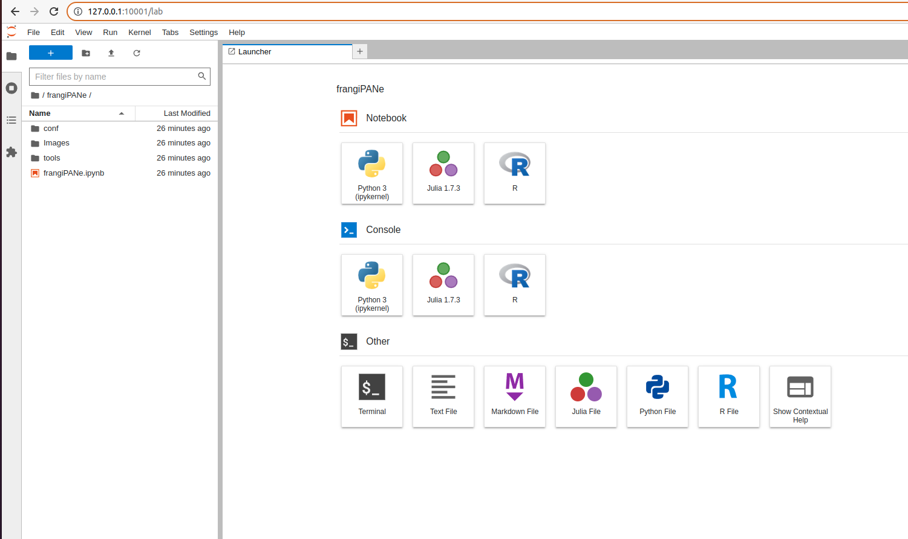
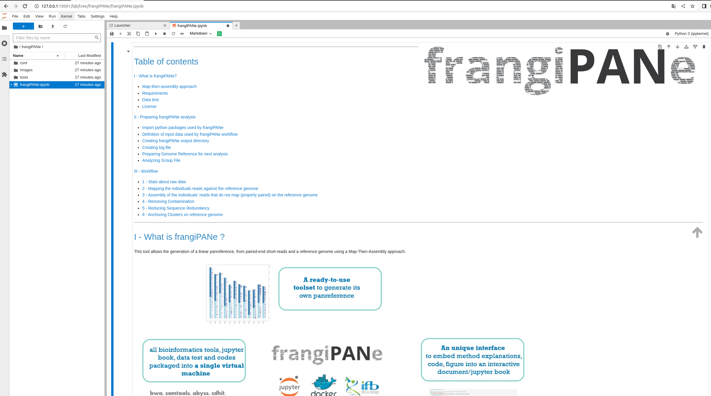
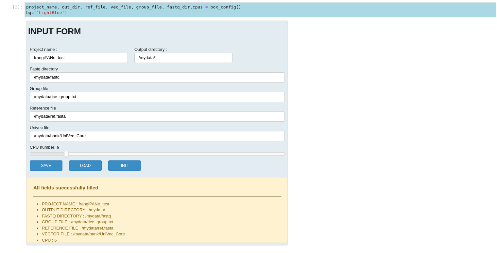

frangiPANe  was  developed  as  a  modular  and  interactive application  to  simplify  the  construction  of  a  panreference using  the  map-then-assembly  approach. It consists in a Jupyter Notebook application that  centralizes  code,documentation and interactive visualizations together


 It  is  available  as a   Docker   image   that   contains   (i)   a   jupypter   notebook centralizing code, documentation and interactive visualization of results, (ii) python scripts and (iii) all the software (XXX)needed for each step of the analysis.


 ### Requirements

 * Docker : https://docs.docker.com/get-docker/
 * Python3 (v3.9.7) : https://www.python.org/
 * biopython : https://biopython.org/
 * panel : https://panel.holoviz.org/

 * abyss : https://github.com/bcgsc/abyss/blob/master/README.md
 * bwa (v. 0.7.17) : https://github.com/lh3/bwa/blob/master/README.md
 * ea-utils (fastq-stats, v 1.01) : https://expressionanalysis.github.io/ea-utils/
 * samtools (v1.10) : http://www.htslib.org/
 * assembly-stats : https://github.com/sanger-pathogens/assembly-stats
 * cd-hit : https://github.com/weizhongli/cdhit/blob/master/README

### How to use FrangiPANe ?

#### On our computer (linux or mac OS)

You have to install git (https://git-scm.com/) and docker (https://docs.docker.com/get-docker/) on your computer.

##### Clone the git repository  

```
git clone https://github.com/tranchant/frangiPANe.git
```

##### Build the docker machine

After installing Docker, build the docker machine. FrangiPANe uses jupyter/datascience-notebook (more information : https://jupyter-docker-stacks.readthedocs.io/en/latest/using/selecting.html)

```
sudo docker build -t frangipane .
```

##### Run FrangiPANe

* Download a dataset to test frangiPANe 

```
wget https://itrop.ird.fr/frangiPANe/data_test.tar.gz
tar zxvf data_test.tar.gz
```

* Launch the docker virtual machine with the command `docker run`. You can connect a local directory to your frangiPANe docker container by using the option -v. So, for example, specify the directory path for the decompressed directory that contains the dataset tot test frangiPANe.

```
docker run -u $(id -u) -v /local/path/2/DATA:/mydata -p 10001:8888 frangipane:latest
```

Around the end of the outputs, you can find the URL with a token. You can :
* copy the url to open it in your default web browser. You have to change the port from 8888 to 10001
* or open the following link in your your default web browser: 
http://127.0.0.1:10001/lab and enter the token to lanch jupyter lab and frangiPANe notebook.

* From the homepage for `jupyter notebook`, open the directory `frangiPANe` then open the jupyter book `frangiPANe.ipynb` 
 


* Once the book opened, execute each notebook's cell.



Nb : If you have connected your docker machine to the local directory with the downloaded dataset as described above, you can test frangiPANe by filling out the form as described below: 



### Licence

* Licencied under CeCill-C (http://www.cecill.info/licences/Licence_CeCILL-C_V1-en.html) and GPLv3

* Intellectual property belongs to IRD/UMR DIADE.

* Written by Clothilde Chenal and Christine Tranchant-Dubreuil

* Copyright 2021
