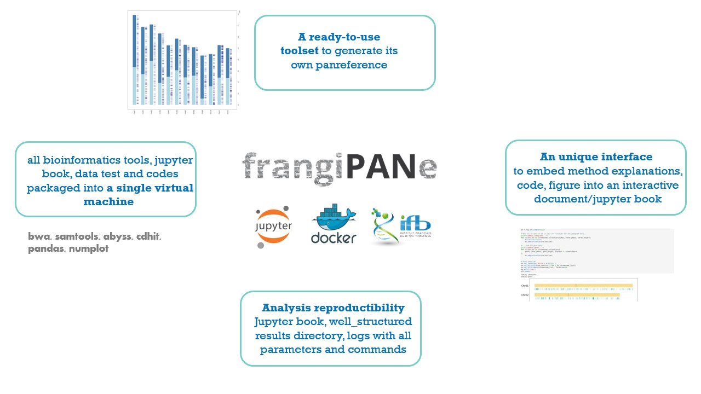

frangiPANe  was  developed  as  a  modular  and  interactive application  to  simplify  the  construction  of  a  panreference using  the  map-then-assembly  approach. It consists in a Jupyter Notebook application that  centralizes  code,documentation and interactive visualizations together



 It  is  available  as a   Docker   image   that   contains   (i)   a   jupypter   notebook centralizing code, documentation and interactive visualization of results, (ii) python scripts and (iii) all the software (XXX)needed for each step of the analysis.


 ### Requirements

 * Docker : https://docs.docker.com/get-docker/
 * Python3 (v3.9.7) : https://www.python.org/
 * biopython : https://biopython.org/
 * panel : https://panel.holoviz.org/

 * abyss : https://github.com/bcgsc/abyss/blob/master/README.md
 * bwa (v. 0.7.17) : https://github.com/lh3/bwa/blob/master/README.md
 * ea-utils (fastq-stats, v 1.01) : https://expressionanalysis.github.io/ea-utils/
 * samtools (v1.10) : http://www.htslib.org/
 * assembly-stats : https://github.com/sanger-pathogens/assembly-stats
 * cd-hit : https://github.com/weizhongli/cdhit/blob/master/README

### How to use FrangiPANe ?

#### from IFB cloud

#### On our computer

##### Clone the git repository  

```
git clone https://github.com/tranchant/frangiPANe.git
```

##### Build the docker machine

After installing Docker, build the docker machine. FrangiPANe uses jupyter/datascience-notebook (more information : https://jupyter-docker-stacks.readthedocs.io/en/latest/using/selecting.html)

```
docker build -t frangipane .
```

##### Run FrangiPANe

```
docker run -u $(id -u) -v /local/path/2/DATA:/home/jovyan -p 10001:8888 frangipane:latest
```

http://127.0.0.1:10001/lab?token=e943b42cfe64a1e76bb2018f90997043cbf3b7618b442ea5

### Licence

* Licencied under CeCill-C (http://www.cecill.info/licences/Licence_CeCILL-C_V1-en.html) and GPLv3

* Intellectual property belongs to IRD/UMR DIADE.

* Written by Clothilde Chenal and Christine Tranchant-Dubreuil

* Copyright 2021
